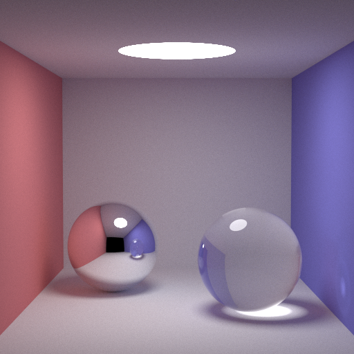

# smallpt_rust

A Rust port of [smallpt](http://www.kevinbeason.com/smallpt/). 
All credit for the original smallpt goes to Kevin Beason.

This project was created as a Rust learning experience. It has not been written
for maximal performance or is meant to be squished into 99 lines as the original
project.

To build smallpt_rust, install Rust alpha2, cd into the root folder and execute *$cargo build --release*

Execute by *$./target/release/smallpt_rust \<samples\_pr\_pixel\>*

Future work  
1) ERPT  
2) QMC RNG  
3) Radiance filter  
4) ???  
5) Profit!
